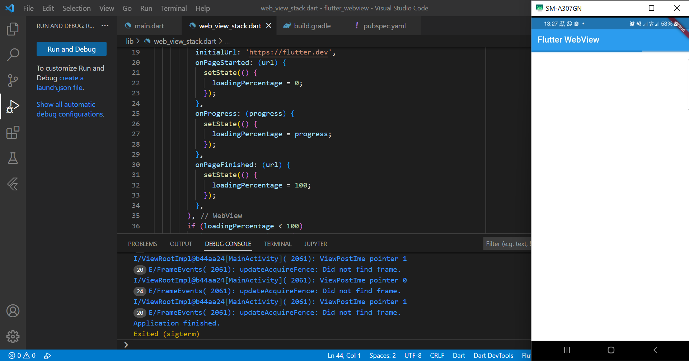
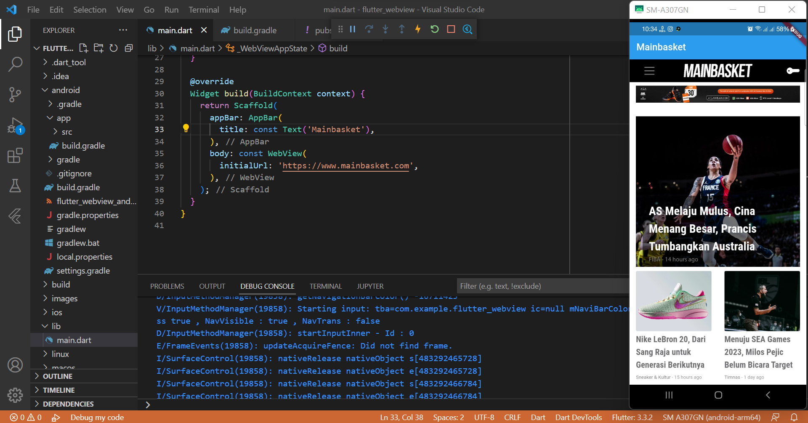
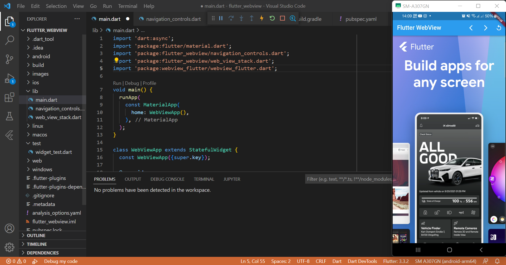
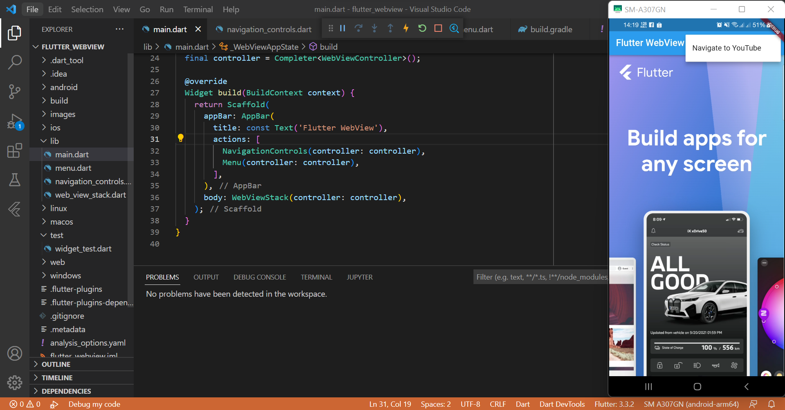
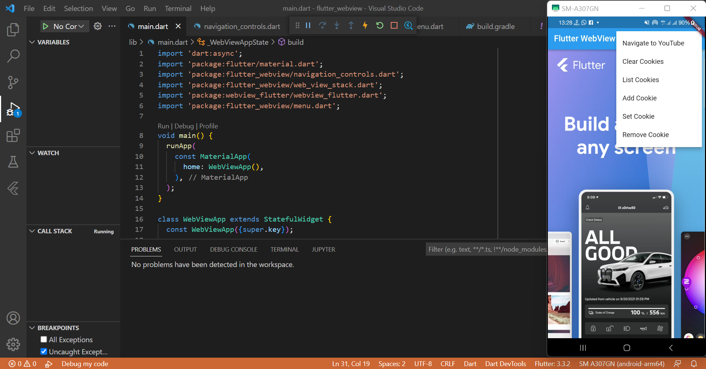
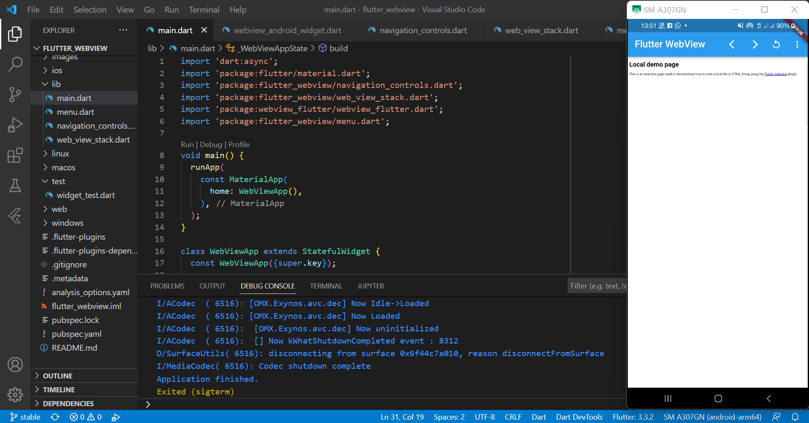

# Laporan Praktikum

## 1. Menambahkan Widget WebView ke Aplikasi Flutter

## 2. Menambahkan loading bar

## 3. Menambahkan Navigation Controls

## 4. Menambahkan Menu Button

## 5. Menambahkan Opsi Cookies

## 6. HTML String

